# Synch GenAI PoC - Agent Architecture Documentation

## System Overview

The Synch GenAI PoC is a comprehensive financial services chatbot platform with 8 specialized AI agents, intelligent routing, and PDF processing capabilities. The system is designed for defensive security applications with built-in PII protection and fraud detection.

## Agent Architecture Flow

```mermaid
flowchart TD
    %% User Input Layer
    User[👤 User Input] --> UI[🖥️ React Frontend]
    
    %% Routing Layer
    UI --> Router{🧭 Smart Router}
    Router --> |"Gemini Classification"| GeminiClass[🤖 Gemini Classifier]
    GeminiClass --> |"confidence < 0.6"| KeywordFallback[📝 Keyword Analysis]
    KeywordFallback --> RouterDecision[📊 Final Route Decision]
    GeminiClass --> |"confidence >= 0.6"| RouterDecision
    
    %% Smart Chat Special Flow
    Router --> |"smart agent"| SmartChat[🧠 Smart Chat Agent]
    SmartChat --> |"Route to best agent"| AutoRoute[🔄 Auto-route to specialist]
    AutoRoute --> Agent1[Agent Selection]
    
    %% Agent Layer
    RouterDecision --> Agent1
    Agent1 --> |"offer"| OfferPilot[🏷️ OfferPilot]
    Agent1 --> |"trust"| TrustShield[🛡️ TrustShield]
    Agent1 --> |"dispute"| DisputeCopilot[⚖️ Dispute Copilot]
    Agent1 --> |"collections"| Collections[💳 Collections Agent]
    Agent1 --> |"devcopilot"| DevCopilot[💻 DevCopilot]
    Agent1 --> |"carecredit"| CareCredit[❤️ CareCredit]
    Agent1 --> |"narrator"| Narrator[📊 Portfolio Narrator]
    Agent1 --> |"imagegen"| ImageGen[🎨 Image Generator]
    
    %% RAG System
    subgraph RAG["🗄️ RAG Knowledge Base"]
        DocStore[(📚 Document Store)]
        Embedder[🔢 Gemini Embeddings]
        Retriever[🔍 Vector Retriever]
        MarkdownDocs[📄 Markdown Documents]
        PDFDocs[📄 PDF Documents]
    end
    
    %% PDF Processing Pipeline
    PDFUpload[📤 PDF Upload] --> PDFProcessor[🔄 LandingAI PDF Processor]
    PDFProcessor --> PDFChunks[📑 Text Chunks + Bounding Boxes]
    PDFChunks --> DocStore
    
    %% Agent Processing
    OfferPilot --> RAG
    TrustShield --> RAG
    TrustShield --> PII[🔐 PII Detection/Redaction]
    DisputeCopilot --> RAG
    Collections --> RAG
    DevCopilot --> APIRef[📖 API Reference]
    CareCredit --> RAG
    Narrator --> RAG
    ImageGen --> StableDiffusion[🎨 Stable Diffusion API]
    
    %% Fallback System
    subgraph Fallbacks["🔄 Intelligent Fallbacks"]
        LLMFallback[🧠 LLM Knowledge Fallback]
        WebSearch[🌐 Web Search Fallback]
        TavilyLegacy[🔍 Tavily Search Legacy]
    end
    
    SmartChat --> |"insufficient docs"| Fallbacks
    
    %% Response Processing
    OfferPilot --> ResponseProc[📤 Response Processing]
    TrustShield --> ResponseProc
    DisputeCopilot --> ResponseProc
    Collections --> ResponseProc
    DevCopilot --> ResponseProc
    CareCredit --> ResponseProc
    Narrator --> ResponseProc
    ImageGen --> ResponseProc
    
    ResponseProc --> |"with citations"| UI
    ResponseProc --> |"confidence score"| UI
    ResponseProc --> |"source tracking"| UI
    
    %% UI Components
    UI --> ChatPane[💬 Chat Interface]
    UI --> AgentSelector[🎛️ Agent Selector]
    UI --> PDFViewer[📄 PDF Viewer]
    UI --> CitationsPanel[📝 Citations Panel]
    UI --> ToolTrace[🔧 Tool Trace Panel]
    
    %% Styling
    classDef userLayer fill:#e1f5fe
    classDef routingLayer fill:#f3e5f5
    classDef agentLayer fill:#e8f5e8
    classDef ragLayer fill:#fff3e0
    classDef uiLayer fill:#fce4ec
    
    class User,UI userLayer
    class Router,GeminiClass,KeywordFallback,RouterDecision,SmartChat,AutoRoute routingLayer
    class OfferPilot,TrustShield,DisputeCopilot,Collections,DevCopilot,CareCredit,Narrator,ImageGen agentLayer
    class RAG,DocStore,Embedder,Retriever,MarkdownDocs,PDFDocs ragLayer
    class ChatPane,AgentSelector,PDFViewer,CitationsPanel,ToolTrace uiLayer
```



## Agent Detailed Specifications

### 🧠 Smart Chat Agent
- **Purpose**: Intelligent routing hub that analyzes queries and routes to the most appropriate specialist agent
- **Key Features**:
  - Uses Gemini LLM for intent classification
  - Confidence-based routing with fallback mechanisms
  - Supports LLM knowledge and web search fallbacks when RAG documents are insufficient
  - Real-time document assessment for relevance
- **Fallback Options**: LLM Knowledge, Web Search, Legacy Tavily
- **Example Query**: *"Find a standing desk under ₹50k with 12-mo 0% APR"*

### 🏷️ OfferPilot
- **Purpose**: Product search and financing options specialist
- **Core Functions**:
  - Product discovery with budget constraints
  - Financing option analysis (APR, payment plans)
  - Promotional offer matching
  - Cross-sell opportunity identification
- **Integration**: Connected to RAG system for product knowledge
- **Example Query**: *"Show me wireless headphones under $200"*

### 🛡️ TrustShield
- **Purpose**: Real-time fraud detection and PII protection system
- **Advanced Capabilities**:
  - Multi-layer scam pattern recognition
  - PII detection and automatic redaction using Microsoft Presidio
  - Risk scoring with confidence metrics
  - Safety guidance recommendations
  - Threat evidence compilation
- **Security Features**: Built-in defensive measures, no malicious code generation
- **Example Query**: *"Someone called asking for my SSN to verify my account"*

### ⚖️ Dispute Copilot
- **Purpose**: Credit card and transaction dispute assistance
- **Specialized Functions**:
  - Dispute classification and merit analysis
  - Evidence collection guidance
  - Chargeback process navigation
  - Documentation requirement checklists
- **Integration**: RAG-powered with dispute resolution knowledge base
- **Example Query**: *"I was charged twice for the same purchase"*

### 💳 Collections Agent
- **Purpose**: Payment assistance and hardship support
- **Customer-Focused Features**:
  - Payment plan options analysis
  - Hardship assessment and solutions
  - Customer state tracking (balance, APR, bucket status)
  - Empathetic communication patterns
- **Data Integration**: Customer account state analysis
- **Example Query**: *"I need help with payment plan options"*

### 💻 DevCopilot
- **Purpose**: Technical support and API documentation assistant
- **Developer Tools**:
  - Code generation for payment processing
  - API endpoint documentation
  - Integration guidance and troubleshooting
  - SDK usage examples
  - Multi-language support (Python, JavaScript, Java, etc.)
- **Knowledge Base**: Technical documentation and best practices
- **Example Query**: *"Generate Python code for payment processing"*

### ❤️ CareCredit
- **Purpose**: Healthcare and medical expense analysis specialist
- **Healthcare Focus**:
  - Medical treatment estimate analysis
  - Dental procedure cost breakdowns
  - Healthcare financing option evaluation
  - Insurance coverage assessment
- **Specialized Knowledge**: Medical billing and healthcare financing
- **Example Query**: *"Analyze this dental treatment estimate"*

### 📊 Portfolio Narrator
- **Purpose**: Business intelligence and portfolio analytics
- **Analytics Capabilities**:
  - Spending pattern analysis
  - Portfolio performance insights
  - Trend identification and explanation
  - Business metrics interpretation
- **Data Sources**: Financial data and portfolio information
- **Example Query**: *"Why did spend drop after 2025-07-31?"*

### 🎨 ImageGen Agent
- **Purpose**: AI-powered visual content generation
- **Creative Features**:
  - Text-to-image generation using Stable Diffusion
  - Style customization options
  - Marketing visual creation
  - Concept visualization
- **API Integration**: Stable Diffusion API
- **Example Query**: *"Create a futuristic city with flying cars and neon lights"*

## System Architecture Components

### 🧭 Intelligent Routing System
- **Primary**: Gemini-powered intent classification
- **Fallback**: Keyword-based pattern matching
- **Confidence Thresholds**: Dynamic routing based on confidence scores
- **Default Routing**: TrustShield for security when confidence is low

### 🗄️ RAG (Retrieval-Augmented Generation) System
- **Document Store**: ChromaDB for vector storage
- **Embeddings**: Google Gemini embedding model
- **Retriever**: Semantic similarity search
- **Content Types**: Markdown documents, PDF processing with bounding boxes

### 📄 PDF Processing Pipeline
- **Processor**: LandingAI PDF processing service
- **Features**: Text extraction, bounding box detection, chunk segmentation
- **Integration**: Automatic indexing into RAG system
- **UI**: Interactive PDF viewer with clickable text chunks

### 🔄 Fallback Mechanisms
1. **Document Assessment**: LLM evaluates if retrieved documents contain sufficient information
2. **LLM Knowledge**: Falls back to pre-trained model knowledge when documents insufficient
3. **Web Search**: Real-time web search for current information
4. **Legacy Tavily**: Backup search integration

### 🔐 Security & Privacy Features
- **PII Detection**: Automatic detection using Microsoft Presidio
- **PII Redaction**: Real-time anonymization of sensitive data
- **Defensive Design**: All agents designed for defensive security use only
- **Fraud Detection**: Multi-pattern scam and threat detection

## API Endpoints

### Smart Chat Endpoints
- `POST /chat` - Main chat interface with fallback options
- `POST /agent/{agent_name}` - Direct agent invocation

### PDF Management
- `POST /upload/pdf` - PDF upload and processing
- `GET /pdf/{pdf_id}/page/{page_num}` - Get PDF page with annotations
- `GET /pdf/{pdf_id}/info` - Get PDF metadata and chunks

### Agent-Specific Endpoints
- `POST /agent/offerpilot` - Product search queries
- `POST /agent/dispute` - Dispute assistance
- `POST /agent/collections` - Payment assistance  
- `POST /agent/devcopilot` - Technical support
- `POST /agent/carecredit` - Healthcare analysis
- `POST /agent/narrator` - Business analytics
- `POST /agent/imagegen` - Image generation
- `POST /agent/trustshield` - Fraud detection

## Frontend Architecture

### React Components
- **ChatPane**: Main conversation interface with PDF drag-and-drop
- **LeftRail**: Agent selection sidebar with examples
- **RightInspector**: Tabbed panel for citations, tool traces, and PDF viewer
- **Header**: Settings controls with elegant toggle switches

### Key Features
- **Real-time Chat**: WebSocket-style communication with loading states
- **PDF Integration**: Drag-and-drop upload with interactive viewer
- **Agent Switching**: Seamless switching between specialized agents
- **Citation Tracking**: Source attribution for all responses
- **Tool Tracing**: Visibility into agent decision-making process

## Deployment & Configuration

### Environment Requirements
- Python 3.8+ with FastAPI
- Node.js 16+ with React/TypeScript
- Google Gemini API access
- LandingAI API for PDF processing
- Optional: Tavily API for web search

### Development Workflow
```bash
# Backend
python main.py

# Frontend
npm run dev
```

### Production Considerations
- CORS configuration for cross-origin requests
- Environment variable management
- API key security
- Rate limiting and usage monitoring

## Security & Compliance

### Defensive Security Focus
- **PII Protection**: Automatic detection and redaction
- **Fraud Prevention**: Real-time threat analysis
- **No Malicious Code**: Designed exclusively for defensive use
- **Source Tracking**: Full audit trail of information sources

### Privacy Features
- **Local Processing**: No persistent user data storage
- **Redaction**: Sensitive information automatically masked
- **Citations**: Transparent source attribution
- **User Control**: Fallback options user-configurable

This architecture provides a robust, scalable, and secure foundation for financial services AI assistance with specialized expertise across multiple domains.